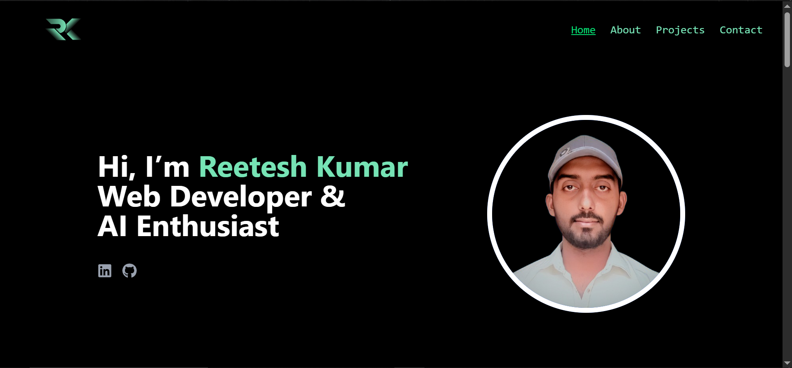
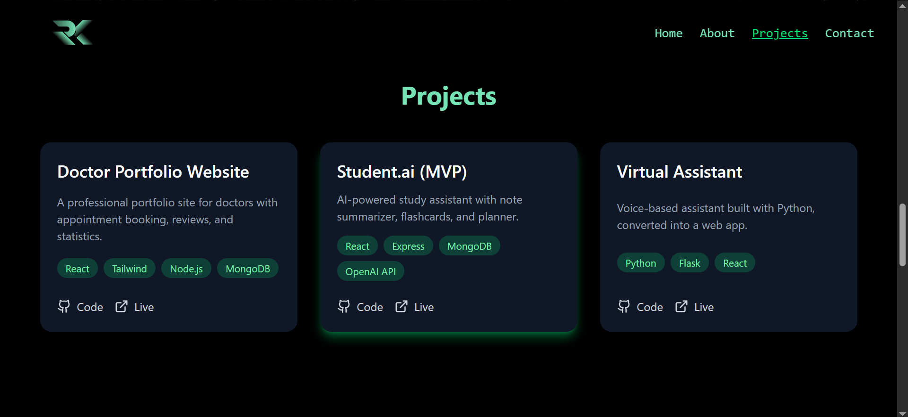

# 🌐 Personal Portfolio Website  

This is my **personal portfolio website** built with **React.js + Tailwind CSS**, showcasing my skills, projects, and experience in **Web Development** and **AI/Data Science**.  

🚀 **Live Demo:** (https://reetesh-portfolio.vercel.app/)

---

## ✨ Features  
- 🎨 Modern, clean, and responsive design  
- 🖥️ Fully mobile-friendly (works on all devices)  
- 📂 Projects showcase with live links & GitHub repos  
- 👨‍💻 About Me, Skills, and Contact sections  
- ⚡ Fast loading and smooth navigation  
- 🌍 Easy deployment with Vercel/Netlify  

---

## 🛠️ Tech Stack  
- **Frontend:** React.js, Tailwind CSS, JavaScript
- **Deployment:** Vercel
- **Version Control:** Git & GitHub  

---

## 📸 Screenshots  

### Home Page  
  

### Projects Page  
  


---

## 📂 Project Structure  
```bash
portfolio-project/
│-- public/            # Static files
│-- src/               # Main source code
│   │-- components/    # Reusable components
│   │-- pages/         # Website pages
│   │-- styles/        # Tailwind/Custom CSS
│-- package.json       # Dependencies
│-- README.md          # Project documentation
